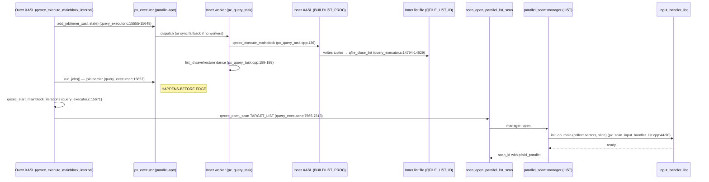

# Parallel List Scan — Open Sequence

> [!warning] Branch-WIP, not in baseline
> Reflects branch `parallel_scan_all` (head `0f8a107bb`, [CBRD-26722], [[prs/PR-7062-parallel-scan-all-types|PR #7062]] OPEN). Will be renamed/relocated when PR #7062 merges. The `S_PARALLEL_LIST_SCAN` scan-id and `scan_open_parallel_list_scan` entry point do not exist in baseline `0be6cdf6`.

End-to-end path for a query that opens a parallel list scan against an inner subquery's materialised list. Driving example:

```sql
SELECT count(*) FROM (
  SELECT /*+ INDEX_SS NO_MERGE */ a, b FROM t WHERE indexed_col BETWEEN 1 AND 100
) tt;
```

The outer's TARGET_LIST scans `tt`'s list file in parallel; the inner runs as a parallel-aptr subquery first, then joins. The crucial property captured here is the writer-done happens-before relationship that prevents the parallel reader from observing a half-written list page (see [[components/parallel-list-scan|parallel-list-scan]] § "TWO header conditions silently skip a page").

## Steps



### Step-by-step

1. **Outer xasl entry.** `qexec_execute_mainblock_internal` runs (`query_executor.c:15151`). The outer block has at least one inner xasl in its aptr-list (uncorrelated subquery for `tt`'s materialisation).

2. **APtr scheduling.** Aptr loop at `query_executor.c:15555-15648`:
   - If parallel-aptr is enabled, `xasl->px_executor->add_job(inner_xasl, state)` ([[components/parallel-query-executor|parallel-query-executor]] `add_job`, `px_query_executor.cpp:101-114`).
   - If parallel reservation failed, falls through to sync `qexec_execute_mainblock(inner_xasl)` (`.c:15601, 15614, 15625`). Sync path inlines steps 3-4 on the main thread.

3. **Inner BUILDLIST_PROC runs to completion.**
   - Worker (or main thread) executes `qexec_execute_mainblock` on the inner XASL via `px_query_task::execute_job_internal` (`px_query_task.cpp:91-228`).
   - On success, `qexec_end_mainblock_iterations` (`query_executor.c:14794`).
   - For BUILDLIST_PROC, the case at `.c:14829` calls `qfile_close_list (xasl->list_id)` — writes `next_vpid = NULL` on the last page + unfixes (see [[components/list-file]] § "qfile_close_list contract"). Note: NO flush; relies on prior tuple-append calls having marked pages dirty.

4. **list_id save/restore dance** (parallel path only).
   - `px_query_task::execute_job_internal` (`px_query_task.cpp:188-199`):
     ```cpp
     QFILE_LIST_ID list_id;                                  // local on stack
     qfile_copy_list_id (&list_id, xasl->list_id, QFILE_MOVE_DEPENDENT);
     qfile_clear_list_id (xasl->list_id);                    // hide from teardown
     qexec_clear_xasl_for_parallel_aptr (...);               // teardown sees empty husk
     qfile_copy_list_id (xasl->list_id, &list_id, QFILE_MOVE_DEPENDENT);  // restore
     ```
   - The dance preserves the materialised list across XASL teardown by hiding it in a stack-local while `qexec_clear_xasl_for_parallel_aptr → qexec_clear_xasl_head → qfile_close_list + qfile_destroy_list` runs against the cleared husk (a no-op since the descriptor was just cleared). See [[components/parallel-query-task]] for the rationale.

5. **Join barrier — `run_jobs()`.**
   - `xasl->px_executor->run_jobs (thread_p)` (`query_executor.c:15657`).
   - Internally: `m_join_context.join_jobs()` — synchronisation point. All inner workers are observably done **before** this returns.
   - **This is the happens-before edge** that closes the silent-skip race in [[components/parallel-list-scan|slot_iterator_list]]. Every inner write (including the `qfile_close_list`-induced last-page `next_vpid = NULL` and the implicit dirty bits from prior `QFILE_PUT_TUPLE_COUNT` calls) is sequenced-before any outer reader's `init_on_main` call to `qfile_collect_list_sector_info`.

6. **Outer scan init.** `qexec_start_mainblock_iterations` (`query_executor.c:15671`).

7. **Outer parallel list scan opens.**
   - `qexec_open_scan` for TARGET_LIST (`query_executor.c:7565-7613`) → `scan_open_parallel_list_scan` (`px_scan.cpp:823`).
   - That function runs `manager::open` → `init_on_main` (`px_scan_input_handler_list.cpp:44-90`), which calls `qfile_collect_list_sector_info` on the now-stable inner list. By the time this runs, the writer's union-of-pages is fully materialised and the writer threads are joined.

## Why the join barrier is load-bearing

The slot iterator's silent-skip on `tuple_count == 0` (see [[components/parallel-list-scan|parallel-list-scan]]) means an outer reader observing a freshly-allocated-but-not-yet-counted page produces a row miss with **no error**. The window is small — between `qfile_allocate_new_page` initialising the header to zero and `qfile_allocate_new_page_if_need` doing `QFILE_PUT_TUPLE_COUNT (*page_p, ... + 1)` at `list_file.c:1581`. But it's a real window.

Closing it requires either:

- **Pre-write barrier**: writer publishes a "done" sentinel readers can observe (would need a new field — QFILE page header has no writer marker, see [[components/list-file]] § "Page header layout").
- **Outer-of-aptr happens-before**: every writer is joined before any reader starts. **This is the chosen design.** `run_jobs()` is the join.

The contract therefore reads: *no path is permitted to open a parallel list scan against a list whose writers have not yet returned through `run_jobs()`*. Auditing this invariant for every aptr/dptr/inline path that produces a list_id is part of the PR #7062 merge gate.

## Sync fallback path

If the parallel-aptr scheduler returns "no workers reserved", aptr execution falls back to sync `qexec_execute_mainblock` on the main thread (`query_executor.c:15601, 15614, 15625`). The list_id save/restore dance is **not** run on the sync path — `xasl->list_id` is fully owned by the executing thread; teardown via the normal end-block path naturally preserves it.

The outer parallel list scan is unaffected by this fallback — it still opens with the inner list fully materialised, just produced single-threaded.

## Failure modes

| Failure | Detection | Recovery |
|---|---|---|
| Inner xasl errors during execute | `move_top_error_message_to_this()` in worker | `run_jobs()` returns the error; outer aborts before `start_mainblock_iterations` |
| Worker reservation fails | `add_job` returns false / `try_reserve_workers(N) == 0` | Sync fallback (single-threaded inner execution) |
| `qfile_collect_list_sector_info` ENOMEM | `init_on_main` returns error | `manager::open` propagates; `scan_open_parallel_list_scan` releases reserved workers, falls back to single-threaded `S_LIST_SCAN` |
| Worker dies between `initialize()` and first `get_next_page_with_fix()` | **Silent slice loss** ([[components/parallel-list-scan|parallel-list-scan]] § "Static partition — no fault tolerance") | Currently none. Worth porting hash-join's dynamic-stealing pattern. |

## Cross-reference

- Reader contract: [[components/parallel-list-scan|parallel-list-scan]]
- Aptr coordinator: [[components/parallel-query-executor|parallel-query-executor]]
- Per-worker task: [[components/parallel-query-task|parallel-query-task]]
- List file primitives: [[components/list-file|list-file]] (`qfile_close_list`, `qfile_collect_list_sector_info`, page header)
- Outer scan dispatch: [[components/scan-manager|scan-manager]]
- Tracking PR: [[prs/PR-7062-parallel-scan-all-types|PR #7062]]
- Jira: CBRD-26722
